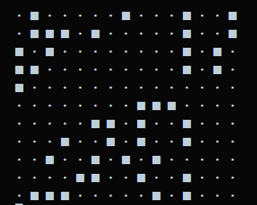

# Day 3 — Conway's Game of Life

## What I built
- Conway's Game of Life in the terminal, built from scratch with plain Python (no numpy). Alive cells show as `■`, dead as `·`. Animates through generations with a short delay.



## How to run
```
py conways_game.py
```

## Rules (for reference)
- Alive cell with 2-3 live neighbors survives
- Alive cell with any other count dies
- Dead cell with exactly 3 live neighbors becomes alive
- Dead cell otherwise stays dead

## Interesting bug / decision
- Kept the grid's real data as `0`/`1`, only converted to `■`/`·` when printing. Tried storing symbols directly at first — broke the neighbor count, since both symbols count as "truthy" in Python.
- Negative indexing bug: `grid[-1]` is valid in Python (wraps to the last row), so edge cells silently grabbed wrong neighbors until I added bounds checks.
</content>
